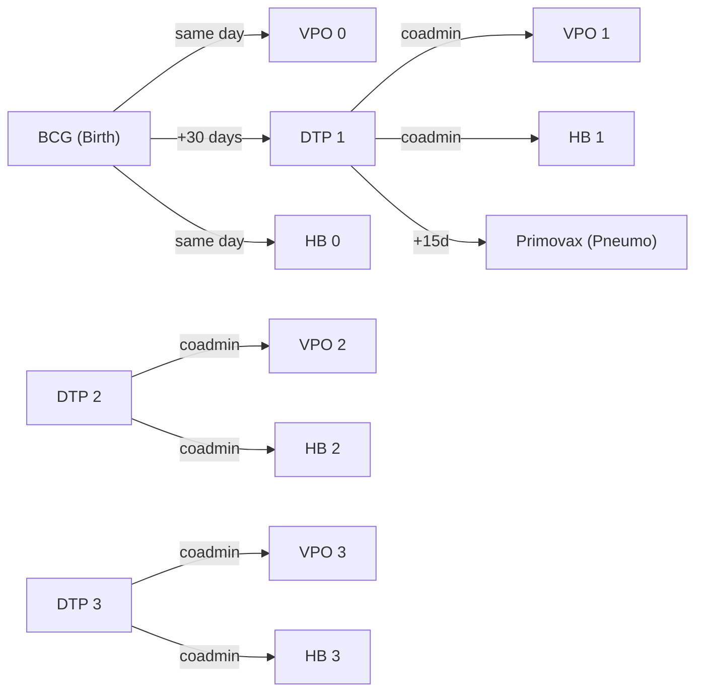

# Engine UX Analysis: Can the Settings UI Be Fixed in Frontend Only?

## TL;DR — **80% Frontend, 20% Backend polish**

The backend model is **already well-structured** for a good UI. The core problem is that the frontend exposes raw engine internals (days-as-integers, flat rule lists, cryptic field names) directly to health workers. This is **a presentation problem, not a data-model problem**. No backend rewrite is needed.

---

## The Complexity Breakdown

### What makes `policy_reference.json` scary

| Factor | Example | Root Cause |
|--------|---------|------------|
| **Ages in raw days** | `min_age_days: 2555` (= 7 years) | Pure display problem |
| **Rule explosion per slot** | DTP slot 1 has **4 rules** (Penta 0-1y, Penta 1-3y, DTC 3-7y, Td 7y+) | Correct modeling — each age-band + product combo needs a row. UI should group & summarize, not flatten. |
| **Redundant-looking fields** | `prior_valid_doses` always = `slot_number - 1` | Backend already validates this (clean()). UI should auto-fill, not ask. |
| **Catch-up vs routine invisible** | HB Series has 14 rules mixing routine & catch-up tracks | Backend already has `category` field + `human_summary`. UI doesn't leverage them well yet. |
| **Transitions & dependencies** | Separate JSON sections cross-referencing series/slots | Structurally sound. UI just needs visual relationship diagrams. |

### Scorecard

```
┌─────────────────────────────────────┬─────────┬───────────┐
│ Problem                             │ Frontend│ Backend   │
├─────────────────────────────────────┼─────────┼───────────┤
│ Days → human-readable ages          │   ✅    │           │
│ Rules grouped by slot + category    │   ✅    │           │
│ Auto-fill prior_valid_doses         │   ✅    │           │
│ Visual timeline/calendar view       │   ✅    │           │
│ Dependency graph visualization      │   ✅    │           │
│ Inline validation & warnings        │   ✅    │           │
│ human_summary on read-only views    │   ✅    │  exists ✅│
│ Age presets (birth/2m/4m/9m/18m)    │   ✅    │           │
│ Better field labels and help text   │   ✅    │           │
│ Rule "wizard" for adding new rules  │   ✅    │           │
│ category field on SeriesRule        │         │  exists ✅│
│ Read-only computed summaries API    │         │  minor ✅ │
└─────────────────────────────────────┴─────────┴───────────┘
```

---

## Why the Backend is Already Good Enough

The models already have the right abstractions:

1. **`SeriesRule.category`** — `routine` / `catchup` / `special` already exists
2. **`SeriesRule.human_summary`** — property that converts days to `2m`, `1y`, etc. already exists
3. **`Vaccine.display_name`**, **`protects_against`**, **`clinical_notes`** — all populated
4. **Validation in `clean()`** — slot_number = prior_valid_doses + 1 is enforced
5. **`DependencyRule`** has `notes`, `is_coadmin`, `block_if_anchor_missing` — rich enough for clear UI

> [!IMPORTANT]
> The data model is **not** the bottleneck. A health worker never reads `policy_reference.json` — they interact through the Django settings UI. The UI is what needs the work.

---

## Concrete Frontend Fixes (No Backend Changes)

### 1. **Age Input with Unit Switcher**
The series form already has `age-conversion-helper` JS, but it's passive (read-only conversion hints). Change to an **active unit selector**:

```
┌──────────────────────────────────────────────┐
│  Min Age:  [2] [months ▼]    = 60 days       │
│  Max Age:  [12] [months ▼]   = 365 days      │
│  Interval: [4] [weeks ▼]    = 28 days        │
└──────────────────────────────────────────────┘
```

The hidden form field stays in days, the user edits in months/weeks/years.

### 2. **Timeline Visualization on Read-Only Settings Page**
For the series list in `settings.html`, replace the raw table with a **horizontal timeline** per series:

```
BCG Series
━━━━━━━━━━━━━━━━━━━━━━━━━━━━━━━━━━━━━━━━━━
Birth ● ─────────────────────────────────── ●
       BCG (0.05ml)                 BCG (0.1ml, if >1y)

DTP Family              
━━━━━━━━━━━━━━━━━━━━━━━━━━━━━━━━━━━━━━━━━
      ● ──── ● ──── ● ────── ● ────────── ●
    2m Penta 3m    4m     18m DTC      5y DTC/Td
```

### 3. **Slot Card Improvements (series_form.html)**
The current grouped UI is a good start but needs:
- **Auto-fill** `prior_valid_doses` when slot_number changes (JS already almost does this)
- **Hide** `slot_number` and `prior_valid_doses` fields — they're redundant for the user
- **Show** a human-readable slot header instead: "**Dose 2** — requires 1 prior dose"
- **Preset buttons** for common age windows: `Birth`, `2 months`, `4 months`, `9 months`, `18 months`, `5 years`

### 4. **Rule Wizard for Adding New Rules**
Instead of showing a raw formset row, show a **step-by-step modal**:

```
Step 1: Which dose slot?   → [Dose 3 ▼]
Step 2: Routine or catch-up?  → [Routine]
Step 3: Which product?    → [Penta ▼]
Step 4: Age window        → [4 months] to [18 months]
Step 5: Min interval      → [28 days]
```

### 5. **Dependency Diagram**
Replace the flat dependency cards with a **visual flow diagram** (using Mermaid or a simple SVG):



---

## Minor Backend Enhancements (Nice-to-Have, Not Required)

These are **small additions** to make the frontend's job easier — not a rewrite:

| Enhancement | Effort | Purpose |
|-------------|--------|---------|
| Add a `@property def age_window_human` to `SeriesRule` | 10 min | Returns `"2 months to 12 months"` for settings list |
| Add a REST endpoint `/api/series/<id>/summary/` | 30 min | Returns grouped, human-readable JSON for timeline rendering |
| Add `human_label` to `DependencyRule` | 10 min | Returns `"VPO 1 given with DTP 1 (co-administration)"` |

> [!TIP]  
> These are all **computed properties or read-only endpoints** — they don't change the underlying data model at all.

---

## Verdict

```
┌─────────────────────────────────────────────────────────────┐
│                                                             │
│   ❌  Backend rewrite needed?          NO                   │
│                                                             │
│   ✅  Frontend UX overhaul?            YES                  │
│                                                             │
│   ✅  Add a few @property helpers?     NICE-TO-HAVE         │
│                                                             │
│   Estimated effort:                                         │
│   • Frontend UX improvements:  ~3-4 days                    │
│   • Backend helpers:           ~2 hours                     │
│                                                             │
└─────────────────────────────────────────────────────────────┘
```

The engine's data model is **correct and complete**. The problem is 100% in how that data is presented to the health worker. The fix is better forms, better visualizations, and smarter defaults — all frontend work.
